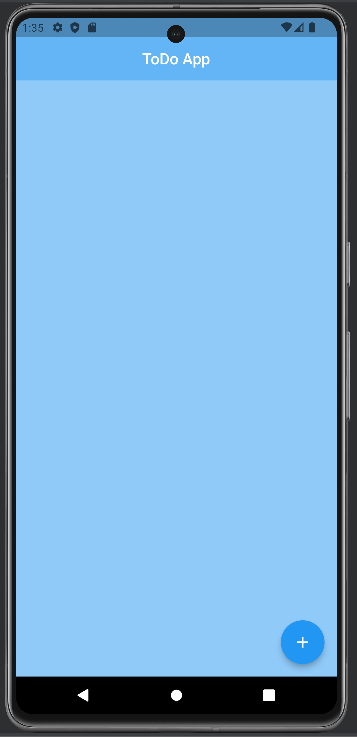
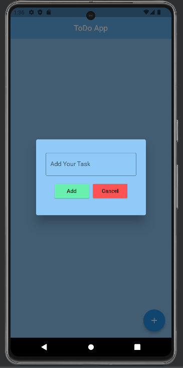
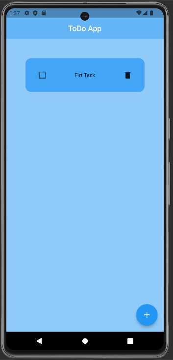
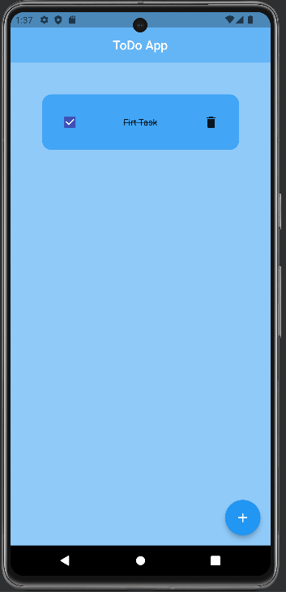

# ToDo App with Flutter

This is a simple ToDo List app developed with Flutter.

## Adding New Task

To add a new task user can click the add ("+") floating button. This action will bring a Dialog Box,
which contains a text field to enter the name of the task. Moreover, there will be two buttons one
is Add button which will add the task to our screen and another button is the Cancel button which will
close the dialog box.

## ToDo Lists

In our main screen we can see all the tasks that we have added. Each ToDo items contains a checkbox
a task name and a delete button.

1. Checkbox: If we click the checkbox then there will be a strike through the task name.
2. Task Name: This is the task name
3. Delete Button: If we click the delete button the list will be deleted and removed from the screen

## Screenshots

